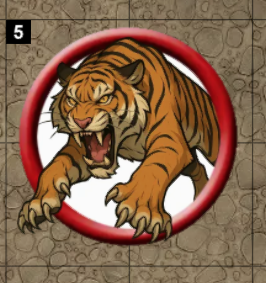

This simple module lets you easily add a counter to a token to keep track of any point system you like.  For exammple, chase points in PF2E. Just drag the point tracker effect from the compendium onto any token. You can increase and decrease the value like any other PF2E effect, such as frightened.

